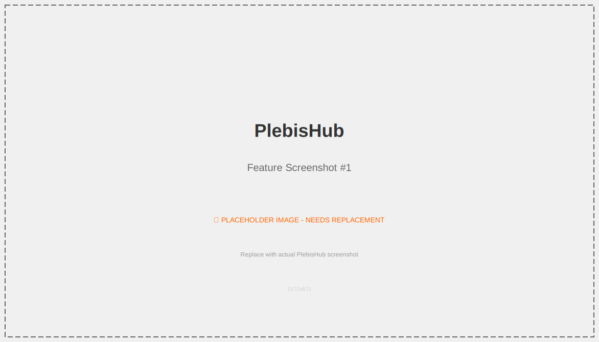
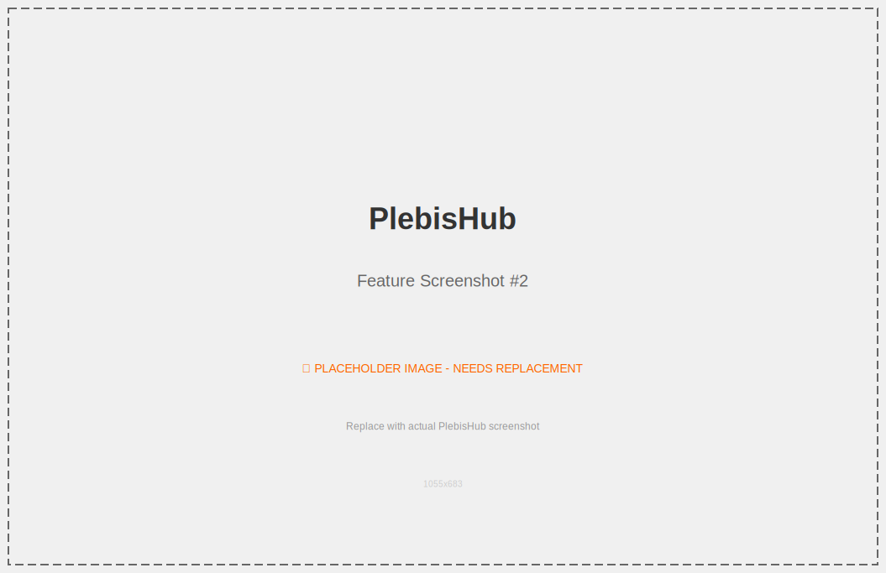

# PlebisHub

[](https://github.com/ggalancs/PlebisHub/actions/workflows/ci.yml)

**PlebisHub** es una plataforma modular de participación ciudadana que nació como un fork de la aplicación "Participa" de Podemos, pero que pretende evolucionar hacia una solución completamente independiente, modular y adaptable a diferentes organizaciones y necesidades.

## Capturas de Pantalla

> **Nota**: Las capturas de pantalla actuales en `doc/images/` son del sistema anterior y están pendientes de actualización. Ver `doc/images/README.md` para más información.






## Sobre este proyecto

Este proyecto mantiene la licencia original de su antecesor, pero representa una nueva dirección hacia una plataforma de participación ciudadana completamente modular y flexible, diseñada para adaptarse a diversos contextos organizativos y democráticos.

## Funcionalidades principales

El objetivo de esta aplicación es ofrecer el siguiente conjunto de herramientas:

- **Votaciones** (integración con Agora Voting)
- **Colaboraciones económicas** (donaciones periódicas)
- **Microcréditos** (sistema de préstamos distribuidos)
- **Notificaciones móviles** (para dispositivos Android)
- **Iniciativas ciudadanas**
- **Equipos de participación**
- **Verificación por SMS**
- **Sistema de publicación de noticias**

### Elecciones

Permite integrado un censo con Agora Voting: _Agora Voting es un software libre de votaciones que permite a cualquier organización realizar procesos electorales de forma segura, flexible, transparente y a un precio competitivo_. Permite que las elecciones se realicen en función a la localización del inscrito.

- https://agoravoting.com/

### Colaboraciones económicas

Permite que los usuarios inscritos puedan suscribir donaciones de forma periódica (mensual, trimestral o anual) por el importe que deseen. Permite que esta colaboración se produzca a través de transferencia bancaria o con tarjeta de crédito (conexión con Redsys).

### Microcréditos

Permite que usuarios (inscritos o no) den de alta microcréditos a la organización de forma puntual.

### Iniciativas Ciudadanas

Sistema de llegada de propuestas filtradas por votaciones con +1 bottom-up.

### Equipos de Participación

Permite a los inscritos darse de alta como interesado en formar parte de equipos localizados geográficamente para fomentar la participación presencial y la formación sobre la participación digital.

### Verificación por SMS

Método de verificación utilizado. Cuando un usuario se inscribe debe confirmar su correo electrónico y su teléfono móvil con un código que se le envía.

### Blog

Sistema de publicación de noticias.

### Newsletter

Sincronización de usuarios entre sistemas para los distintos casos que puede haber de falta de sincronía entre las bases de datos, es decir, si un usuario se quiere dar de baja sólo de la newsletter o si quiere darse de baja completamente como usuario.

- https://sendy.co/

### Formularios y páginas estáticas

Sistema de integración con formularios basados en Wordpress (con el plugin Gravity Forms).

- http://www.gravityforms.com/

### Notificaciones móviles

Se ha desarrollado una aplicación en Android que puede enviar notificaciones a los dispositivos móviles. Se trata de una aplicación realizada con Phonegap, por lo que está planificado su desarrollo para iOS (iPhone e iPad).

### OpenID

Se ha configurado para que la aplicación sea un proveedor de OpenID, por lo que permite que otras aplicaciones autentifiquen contra los usuarios del censo.

## Instalación

Es una aplicación Ruby On Rails actualizada a Rails 7.2 / Ruby 3.3.

### Instalación con Docker (Recomendada)

La forma más fácil de instalar PlebisHub es usando Docker. Solo necesitas tener Docker y Docker Compose instalados.

**Instalación en un solo comando:**

```bash
./quick-start.sh
```

Esto automáticamente:

- Crea la configuración con secretos seguros generados
- Construye las imágenes Docker
- Inicia PostgreSQL, Redis y la aplicación Rails
- Configura la base de datos

**Accesos después de la instalación:**

- 🌐 Aplicación Web: http://localhost:3000
- 👤 Panel de Admin: http://localhost:3000/admin
- 💚 Health Check: http://localhost:3000/health

**Comandos útiles:**

```bash
make start          # Iniciar servicios
make stop           # Parar servicios
make logs           # Ver logs
make console        # Consola de Rails
make shell          # Terminal del contenedor
make db-migrate     # Ejecutar migraciones
make help           # Ver todos los comandos
```

**Modo desarrollo (con Vite HMR):**

```bash
./quick-start.sh development
```

### Instalación Manual (Sin Docker)

Se recomienda hacerla en sistemas operativos GNU/Linux (nosotros usamos Ubuntu).
Para manejar las gemas recomendamos rvm o rbenv.
Para la BBDD recomendamos postgres, pero se puede usar también mysql/sqlite3.

Una vez se tenga configurado el rvm o rbenv los pasos a seguir serían los siguientes:

```bash
bundle install
cp config/database.yml.example config/database.yml
cp config/secrets.yml.example config/secrets.yml
rake db:migrate
rails server
```

Aparte de esto para algunas acciones utilizamos [resque](https://github.com/resque/resque), una cola para trabajos asíncronos.

## Tests

Se pueden comprobar los tests con

```bash
rake test
```

## APIs externas

- Para las votaciones de los usuarios usamos [Agora Voting](https://agoravoting.com/). La configuración del secreto compartido se encuentra en una clave de `secrets.yml`. Documentación: [Sobre la integración](https://github.com/agoravoting/agora-core-view/blob/master/INTEGRATION.md), [Sobre la API REST general de AgoraVoting](https://agora-ciudadana.readthedocs.org/).

- Para el envío de SMS usamos [esendex](http://esendex.es/). Puede comprobarse con el comando `rake esendex:validate[username,password,account_reference]`. La configuración de la autenticación se encuentra en unas claves de `secrets.yml`.

- Para el control de excepciones en staging y production usamos una instancia privada de [errbit](https://github.com/errbit/errbit), una aplicación libre basada en la API de [airbrake](https://airbrake.io/). Puede comprobarse la conexión con el servidor con el comando `rake airbrake:test`. La configuración de la autenticación se encuentra en unas claves de `secrets.yml`.

- Para la gestión de las colas de trabajo utilizamos [resque](https://github.com/resque/resque/), que usa como DDBB redis. Un comando útil para desarrollo es el de iniciar un worker: `rake resque:work`

- En desarrollo, para comprobar el envío de correos, utilizamos [mailcatcher](http://mailcatcher.me/), una gema que levanta un servidor SMTP en el puerto 1025 y una interfaz web para ver los correos que se envían en el puerto 1080.

  **Instalación** (se instala separadamente del proyecto para evitar conflictos de dependencias):

  ```bash
  gem install mailcatcher
  ```

  **Uso**:

  ```bash
  mailcatcher
  ```

  Luego acceder a `http://localhost:1080` para ver los correos enviados.

  > **Nota**: Mailcatcher se instala como gema del sistema, no en el Gemfile de la aplicación, ya que sus dependencias (sinatra) podrían conflictuar con las del proyecto

- Para el envío de correo en producción usamos [Amazon SES](http://aws.amazon.com/es/ses/). La configuración va en `config/secrets.yml`.

## Dependencias

Para ejecutar la aplicación en su totalidad hay que tener los siguientes servicios en funcionamiento:

```bash
sudo apt-get install libicu52                       # para manejar cadenas Unicode correctamente
sudo apt-get install postgres                       # para la base de datos, o mysql-server si lo prefieres
sudo apt-get install imagemagick                    # para la generación del captcha
sudo apt-get install redis-server                   # para la gestión de las colas de trabajo (resque)
sudo apt-get install libpq-dev                      # para la gema pg
sudo apt-get install qt5-default libqt5webkit5-dev  # para capybara (tests)
sudo apt-get install wkhtmltopdf                    # para generación de PDFs (microcreditos)
sudo apt-get install espeak lame                    # para audio captchas
```

## Configuraciones

Se ha intentado que todas las configuraciones estén accesibles con los ficheros de configuración

```
config/databases.yml
config/secrets.yml
```

Ver ejemplos en `config/databases.yml.example` y `config/secrets.yml.example`.

## i18n

Para modificar los distintos idiomas, revisar los ficheros de `config/locales/`
Para agregar uno nuevo se deben seguir los siguientes pasos:

- Agregarlo en la línea de 'scope locale' en `config/routes`
- Agregarlo en la UI de cambio de idiomas del footer en `app/views/layouts/application.html.erb`
- Agregarlo en la configuración para idiomas válidos en `config/application.rb`

## Colaboraciones económicas

Para la forma de pago "Suscripción con Tarjeta de Crédito/Débito" hemos hecho una integración con Redsys.

Para esto hace falta tener una cuenta bancaria dada de alta en Redsys, tener acceso a su [entorno de pruebas](https://sis-t.redsys.es:25443/canales/) y configurar los parámetros necesarios en config/secrets.yml

Se pueden ver los documentos desde los que se han partido para su implementación en `doc/redsys`.

## Licencia

Este proyecto mantiene la licencia original de su antecesor. Ver el archivo [LICENSE](LICENSE) para más detalles.

## Créditos

Este proyecto nació como un fork de la aplicación "Participa" desarrollada originalmente para Podemos. Agradecemos a los desarrolladores originales por su trabajo en crear una base sólida para la participación democrática digital.

---

**Nota**: Este es un proyecto en evolución activa hacia una plataforma completamente modular e independiente.
